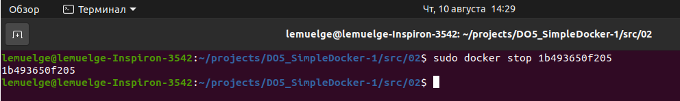
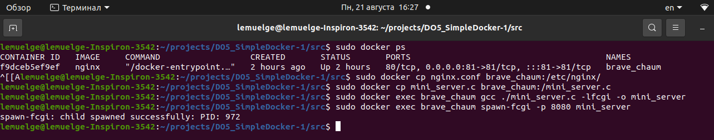
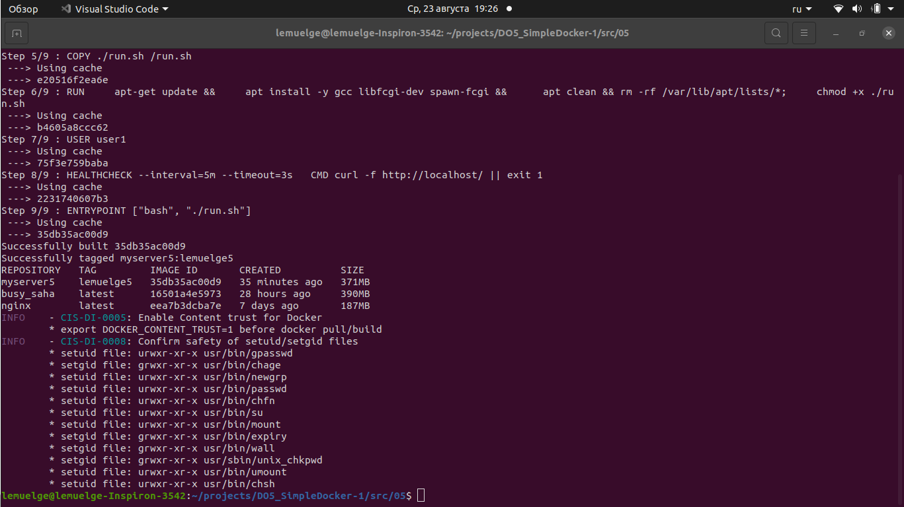

# my_devops_project_4
***

- [1. Готовый докер](#1-готовый-докер)
- [2. Операции с контейнером](#2-операции-с-контейнером)
- [3. Мини веб-сервер](#3-мини-веб-сервер)
- [4. Свой докер](#4-свой-докер)
- [5. Dockle](#5-dockle)
- [6. Базовый Docker Compose](#6-базовый-docker-compose)

***
## 1. Готовый докер

### Взять официальный докер образ с nginx и выкачать его при помощи `docker pull`


*Рисунок 1.1 - Выполнение команды `sudo docker pull nginx`*

> Примечание: После выполнения данной команды терминал может вывести сообщение о том, что docker не установлен. Чтобы установить docker, выполните команду `sudo apt-get install docker-ce`._

### Проверить наличие докер образа через `docker images`


*Рисунок 1.2 - Выполнение команды `sudo docker images`*

### Запустить докер образ через `docker run -d [image_id|repository]`


*Рисунок 1.3 - Выполнение команды `sudo docker run -d 89da1fb6dcb9`*

### Проверить, что образ запустился через `docker ps`


*Рисунок 1.4 - Выполнение команды `sudo docker ps`*

### Посмотреть информацию о контейнере через `docker inspect [container_id|container_name]`


*Рисунок 1.5 - Выполнение команды `sudo docker inspect e63e0894bb9e`*


*Рисунок 1.6 - Размер контейнера после выполнения команды `sudo docker inspect --size -f 'RW = {{ .SizeRw }}' compassionate_ganguly`*


*Рисунок 1.7 - Список замапленных портов `sudo docker inspect -f '{{range.NetworkSettings.Networks}}{{.IPAddress}}{{end}}' compassionate_ganguly`. Как мы видим, порт 80 не замаплен*


*Рисунок 1.8 - IP контейнера после выполнения команды `sudo docker inspect -f '{{.NetworkSettings.Ports}}' compassionate_ganguly`*

### Остановить докер образ через `docker stop [container_id|container_name]`


*Рисунок 1.9 - Выполнение команды `sudo docker stop e63e0894bb9e`*

### Проверить, что образ остановился через `docker ps`


*Рисунок 1.10 - Выполнение команды `sudo docker ps`*

### Запустить докер с портами 80 и 443 в контейнере, замапленными на такие же порты на локальной машине, через команду `run`

Для начала узнаем id докер-образа с помощью команды `sudo docker images`


*Рисунок 1.11 - Выполнение команды `sudo docker images`*

Затем выполним команду `sudo docker run -d -p 80:80 -p 443:443 89da1fb6dcb9` для запуска докера с портами 80 и 443 в контейнере


*Рисунок 1.12 - Выполнение команды `sudo docker run -d -p 80:80 -p 443:443 89da1fb6dcb9`*

### Проверить, что в браузере по адресу localhost:80 доступна стартовая страница nginx

Открываем браузер, например, Google Chrome. Далее в поисковой строке набираем `localhost:80` и нажимаем Enter.


*Рисунок 1.13 - Стартовая страница nginx*

### Перезапустить докер контейнер через `docker restart [container_id|container_name]`

Для начала узнаем id контейнера через команду `sudo docker ps`


*Рисунок 1.14 - Выполнение команды `sudo docker ps`*

Затем выполняем команду `sudo docker restart 1b493650f205`


*Рисунок 1.15 - Выполнение команды `sudo docker restart 1b493650f205`*

Теперь проверим, что наш контейнер запустился. Выполним команду `sudo docker ps`


*Рисунок 1.16 - Выполнение команды `sudo docker ps`*


***
## 2. Операции с контейнером

### Прочитать конфигурационный файл nginx.conf внутри докер контейнера через команду `exec`

Немного информации про файл nginx.conf.

> Файл __nginx.conf__ - это конфигурационный файл для сервера Nginx. Он определяет параметры и настройки, необходимые для работы сервера, включая виртуальные хосты, прокси, настройки безопасности, кеширование, SSL-сертификаты и другие параметры. Вот примерный обзор того, что файл nginx.conf может содержать:

* __Базовые настройки:__
    * user: Определяет пользователя и группу, от имени которых будет запущен процесс Nginx;
    * worker_processes: Количество worker-процессов для обработки запросов.
* __Глобальные блоки:__
  * events: Настройки для событийной модели, такие как количество одновременных подключений.
* __HTTP блок:__
  * http: Основной блок для настройки HTTP-сервера;
  * server: Блок настроек для виртуальных хостов (сайтов);
  * listen: Определяет порт и/или IP-адрес, на котором сервер будет слушать входящие соединения;
  * location: Определяет настройки для конкретного пути на сервере.
* __Блоки настроек:__
  * server_name: Определяет имя сервера (доменное имя), которое будет использоваться для обработки запросов;
  * location: Настройки для конкретных путей на сервере, такие как правила маршрутизации или обработки файлов.
* __Проксирование:__
  * proxy_pass: Определяет адрес прокси-сервера, куда будут перенаправляться запросы.
* __Кеширование:__
  * proxy_cache: Настройки кеширования для прокси-сервера.
* __SSL:__
  * ssl_certificate и ssl_certificate_key: Пути к SSL-сертификату и его приватному ключу для обеспечения HTTPS-соединений.
* __Логирование:__
  * access_log и error_log: Пути к файлам для записи логов доступа и ошибок.
* __Дополнительные настройки:__
  * include: Подключение дополнительных файлов с настройками;
  * if: Условные конструкции для определения действий в зависимости от условий запроса.
* __Другие параметры:__
  * gzip: Настройки сжатия данных;
  * expires: Настройки времени кеширования.


*Рисунок 2.1 - Выполнение команды `sudo docker exec 1b493650f205 cat /etc/nginx/nginx.conf`*

### Создать на локальной машине файл nginx.conf. Настроить в нем по пути /status отдачу страницы статуса сервера nginx

В папке проекта я создал файл nginx.conf с помощью команды `touch nginx.conf`. Затем в открыл файл nginx.conf в программе VS Code, вставил содержимое файла из первого пункта задания (см. рисунок 2.1), добавил к коду следующий кусок кода:

```bash
server {
    listen 80;
    server_name localhost;

    location /status {
        stub_status on;
        access_log off;
        allow 127.0.0.1;  # Разрешить доступ только с localhost
    }
}
```
После этого я закомментировал строку:

```bash
include /etc/nginx/conf.d/*.conf;
```
Подробнее о каждой строке:

* __listen 80:__ Эта строка указывает серверу слушать на порту 80, что является стандартным HTTP-портом для негарантированных соединений.
* __server_name localhost:__ Это задает имя сервера (доменное имя), для которого будут применяться настройки внутри этого блока. В данном случае, сервер будет отвечать на запросы, адресованные на localhost.
* __stub_status on:__ Эта директива включает отдачу страницы статуса сервера. Страница статуса предоставляет информацию о текущей нагрузке, количестве активных соединений и другой статистике сервера.
* __access_log off:__ Эта директива отключает логирование доступа для этого пути. Таким образом, запросы к /status не будут логироваться.
* __allow 127.0.0.1:__ Эта директива указывает, каким IP-адресам разрешен доступ к данному пути. В данном случае, доступ разрешен только с IP-адреса 127.0.0.1 (localhost), что обеспечивает безопасность этой страницы статуса.


*Рисунок 2.2 - Выполнение команды `cat nginx.conf`*

### Скопировать созданный файл nginx.conf внутрь докер образа через команду `docker cp`

Выполняю команду `sudo docker ps`, чтобы узнать id контейнера. Далее выполняю копирование файла nginx.conf из текущей папки внутрь докер-образа с помощью команды `sudo docker cp nginx.conf 1b493650f205:/etc/nginx/nginx.conf`


*Рисунок 2.3 - Выполнение команд `sudo docker ps` и `sudo docker cp nginx.conf 1b493650f205:/etc/nginx/nginx.conf`*

### Перезапустить nginx внутри докер образа через команду `exec`

Перезапускаю nginx с помощью команды `sudo docker exec 1b493650f205 nginx -s reload`


*Рисунок 2.4 - Выполнение команды `sudo docker exec 1b493650f205 nginx -s reload`*

### Проверить, что по адресу localhost:80/status отдается страничка со статусом сервера nginx

Проверяю, что после выполнения команды `curl localhost:80/status` отдается страничка со статусом сервера nginx


*Рисунок 2.5 - Выполнение команды `curl localhost:80/status`*

### Экспортировать контейнер в файл container.tar через команду `export`

Выполняю команду `sudo docker export 1b493650f205 > container.tar` и проверяю, что файл появился в текущей директории с помощью команды `ls`


*Рисунок 2.6 - Выполнение команды `sudo docker export 1b493650f205 > container.tar` и `ls`*

### Остановить контейнер

Выполняю остановку контейнера командой `sudo docker stop 1b493650f205`



*Рисунок 2.7 - Выполнение команды `sudo docker stop 1b493650f205`*

### Удалить образ через `docker rmi [image_id|repository]`, не удаляя перед этим контейнеры

Удаляю образ командой `sudo docker rmi -f 89da1fb6dcb9`


*Рисунок 2.8 - Выполнение команды `sudo docker rmi -f 89da1fb6dcb9`*

### Удалить остановленный контейнер

Удаляю остановленный контейнер командой `sudo docker rm 1b493650f205` и потом проверяю командой `sudo docker ps -a`, что контейнер удалился.


*Рисунок 2.9 - Выполнение команд `sudo docker rm 1b493650f205` и `sudo docker ps -a`*

### Импортировать контейнер обратно через команду `import`

Выполняю импорт командой `sudo docker import container.tar nginx:latest`, где ___nginx___ - это имя образа (REPOSITORY), а ___latest___ - это тэг образа (TAG).


*Рисунок 2.10 - Выполнение команды `sudo docker import container.tar nginx:latest`*

### Запустить импортированный контейнер

Выполняю команду `sudo docker run -d -p 80:80 nginx:latest nginx -g "daemon off;"`, где ___nginx:latest___ - это имя и тег образа, а ___nginx -g "daemon off;"___ - это команда, которая будет выполняться внутри контейнера. Она используется для запуска nginx и удерживания контейнера в фоновом режиме.
Затем командой `sudo docker ps` проверяю, что контейнер успешно запущен


*Рисунок 2.11 - Выполнение команд `sudo docker run -d -p 80:80 nginx:latest nginx -g "daemon off;"` и `sudo docker ps`*

### Проверить, что по адресу localhost:80/status отдается страничка со статусом сервера nginx

Проверяю командой `curl localhost:80/status`, что отдается страничка со статусом сервера nginx


*Рисунок 2.12 - Выполнение команды `curl localhost:80/status`*


***
## 3. Мини веб-сервер

### Написать мини сервер на C и FastCgi, который будет возвращать простейшую страничку с надписью Hello World!

* Сначала очистим докер от ненужных образов. Для этого нужно использовать команду `sudo docker system prune`


*Рисунок 3.1 - Выполнение команды `sudo docker system prune`*

* Создадим файл __mini_server.c__ и напишем свой мини-сервер


*Рисунок 3.2 - Содержимое файла __mini_server.c__*

* Запустим написанный мини-сервер через __spawn-fcgi__ на порту 8080. Для этого загрузим docker командой `sudo docker pull nginx`. Далее запустим образ с портом 81


*Рисунок 3.3 - Выполнение команд `sudo docker pull nginx` и `sudo docker run -d -p 81:81 nginx`*

* Обновим контейнер перед загрузкой библиотек и установим нужные библиотеки с помощью команд `sudo docker exec brave_chaum apt update` и `sudo docker exec brave_chaum apt install -y gcc spawn-fcgi libfcgi-dev`. После этого сделаем коммит изменений


*Рисунок 3.4 - Выполнение команды `sudo docker commit f9dceb5ef9ef brave_chaum`*

### Запустить написанный мини сервер через spawn-fcgi на порту 8080

* Загрузим в контейнер файлы __nginx.conf__ и __mini_server.c__ с помощью команд `sudo docker cp nginx.conf brave_chaum:/etc/nginx/` и `sudo docker cp mini_server.c brave_chaum:/mini_server.c`. Затем скомпилируем сервер командой `sudo docker exec brave_chaum gcc ./mini_server.c -lfcgi -o mini_server`. Теперь запустим мини-сервер через spawn-fcgi на порту 8080 командой `sudo docker exec brave_chaum spawn-fcgi -p 8080 mini_server`



*Рисунок 3.5 - Выполнение команд для запуска мини-сервера. Строка __spawn-fcgi: child spawned successfulle: PID: 972 означает__, что процесс порожден с PID 972. Это указывает на успешное создание дочернего процесса с использованием __spawn-fcgi__*

* Перезапустим контейнер с изменениями командой `sudo docker exec brave_chaum nginx -s reload`


*Рисунок 3.6 - Выполнение команды `sudo docker exec brave_chaum nginx -s reload`*

### Написать свой nginx.conf, который будет проксировать все запросы с 81 порта на 127.0.0.1:8080


*Рисунок 3.7 - Содержимое файла `nginx.conf`*

### Проверить, что в браузере по localhost:81 отдается написанная вами страничка


*Рисунок 3.8 - Вывод в браузере __Hello world!__*

### Положить файл nginx.conf по пути ./nginx/nginx.conf (это понадобится позже)


*Рисунок 3.9 - Выполнение команды `sudo docker cp nginx.conf brave_chaum:/etc/nginx/`*


***
## 4. Свой докер

### Написать свой докер образ, который:

* собирает исходники мини сервера на FastCgi из [Части 3](#part-3-мини-веб-сервер)
* запускает его на 8080 порту
* копирует внутрь образа написанный ./nginx/nginx.conf
* запускает nginx.

Создадим Dockerfile и напишем следующие команды:


*Рисунок 4.1 - Содержимое Dockerfile*

Создадим файл nginx.conf


*Рисунок 4.2 - Содержимое файла nginx.conf*

Файл с исходным кодом мини-сервера я взял из [Части 3](#part-3-мини-веб-сервер)

Для удобства выполнения дальнейших шагов я написал следующие скрипты:


*Рисунок 4.3 - Содержимое файла run_dockerfile.sh*


*Рисунок 4.4 - Содержимое файла run.sh*

Запускаю я скрипт __run_dockerfile.sh__, а скрипт __run.sh__ запускается уже в докере.

> Примечание: Перед запуском нужно убедиться, что порт 80 не занят. Необходимо проверить, занимают ли контейнеры данный порт командой `sudo docker ps`. Если да, то нужно контейнеры остановить командой `docker stop <container_id>`.

Так же необходимо проверить, что служба __nginx__ отключена. Данная служба обычно занимает порт 80. Проверить активность службы можно командой `sudo service nginx status`, а отключить - `sudo service nginx stop`.

### Собрать написанный докер образ через docker build при этом указав имя и тег

`sudo docker build . -t myserver:lemuelge`

### Проверить через docker images, что все собралось корректно

`sudo docker images`

### Запустить собранный докер образ с маппингом 81 порта на 80 на локальной машине и маппингом папки ./nginx внутрь контейнера по адресу, где лежат конфигурационные файлы nginx'а [(см. Часть 2)](#part-2-операции-с-контейнером)

`sudo docker run -d -p 80:81 --rm --name server myserver:lemuelge`

### Проверить, что по localhost:80 доступна страничка написанного мини сервера

`curl localhost:80`

### Дописать в ./nginx/nginx.conf проксирование странички /status, по которой надо отдавать статус сервера nginx
### Перезапустить докер образ
### Проверить, что теперь по localhost:80/status отдается страничка со статусом nginx


*Рисунок 4.5 - Запуск вышеперечисленных команд*


*Рисунок 4.6 - Вывод в браузере __localhost:80/status__*


***
## 5. Dockle

> __Dockle__ - это инструмент для статического анализа безопасности контейнеров Docker. Он предназначен для сканирования Docker-образов и контейнеров на наличие практик безопасности, нарушений стандартов и потенциальных уязвимостей. Dockle помогает выявить потенциальные проблемы ещё на этапе разработки и сборки образов, что позволяет обеспечить безопасность вашего приложения ещё до запуска контейнера.

Перед тем, как приступить к выполнению задания, необходимо установить Dockle. Ниже приведены шаги, которые я сделал для этого.

* В первую очередь я скачал Go версии 1.21 для Linux, он нужен для установки Dockle. [Ссылка для скачивания](https://go.dev/dl/)
* Через терминал я зашел в директорию, куда скачался архив, распаковал его командой `sudo tar -C /usr/local -xzf go1.21.0.linux-amd64.tar.gz ` в директорию __/usr/local__
* Затем командой `sudo vim ~/.profile` добавил следующие строки в конец файла:
  
```bash
export PATH=$PATH:/usr/local/go/bin
export GOPATH=$HOME/go
export GOBIN=$GOPATH/bin
```

Это нужно для того, чтобы команда `go` работала в терминале. После этого я выполнил команду `source ~/.profile`, чтобы изменения применились.

* Необходимо перезапустить терминал и затем выполнить команду `go version`. Терминал выведет версию установленного Go
* Далее нужно установить __goreleaser__ командой `sudo apt install -y goreleaser`
* Cоздаем папку командой `mkdir -p ~/temp/dockle` и переходим в нее командой `cd ~/temp/dockle`
* Клонируем Dockle командой `git clone https://github.com/goodwithtech/dockle.git .`
* Выполняем сначала команду `go mod tidy`, а затем `goreleaser build --skip-validate`
* После завершения установки нужно зайти в папку __dist__. Там будут папки с файлом dockle для разных архитектур. Я выбрал __dockle_linux_amd64_v1__, зашел в эту папку, переместил файл командой `sudo mv dockle /usr/local/bin/`
* После этого проверил версию Dockle командой `dockle -v`

### Просканировать образ из предыдущего задания через dockle [image_id|repository]

> Примечание: При выполнении команды `dockle [image_id|repository]` могут возникнуть проблемы с доступом к образам. Чтобы избежать этого, необходимо добавлять __sudo__ перед __dockle__.

* Я переместил все файлы 4 задания из папки 04 в папку 05. Единственное, что я поменял, так это имя образа и контейнера в скрипте, чтобы было отличие от образа из 4 задания.


*Рисунок 5.1 - Содержимое файла __run_dockerfile.sh__*

* Запустим данный скрипт и после этого выполним команду `sudo dockle [image_id|repository]`


*Рисунок 5.2 - Выполнение команды `sudo dockle myserver5:lemuelge5`*

### Исправить образ так, чтобы при проверке через dockle не было ошибок и предупреждений (FATAL и WARM)

> В контексте вывода инструмента dockle, ошибки и предупреждения относятся к выявленным проблемам в безопасности Docker-образов. Вот разъяснение различий между ошибками и предупреждениями:
> * Ошибки (FATAL): Ошибки указывают на реальные и серьезные нарушения безопасности в Docker-образе. Эти нарушения требуют обязательного вмешательства, чтобы устранить риски. Примеры ошибок в выводе dockle могут включать:
>   * Важные конфиденциальные данные, такие как пароли или ключи, хранятся внутри образа.
>   * Отсутствие необходимых настроек безопасности.
>   * Использование устаревших или уязвимых компонентов.
> * Предупреждения (WARN): Предупреждения указывают на потенциальные проблемы в безопасности, которые не являются критическими, но могут потребовать дополнительного внимания и оценки. Они предоставляют информацию о возможных рисках. Примеры предупреждений в выводе dockle могут включать:
>   * Использование образа с тегом "latest", что может вызвать проблемы при обновлении.
>   * Отсутствие рекомендуемых настроек безопасности, но без прямого угрозы.
>* Информационные сообщения (INFO): Информационные сообщения предоставляют дополнительную информацию о выполняемых проверках, рекомендациях и контексте безопасности. Они не являются ошибками или предупреждениями, и их цель — повысить осведомленность пользователя о настройках безопасности. Примеры информационных сообщений в выводе dockle могут включать:
>   * Рекомендации по настройке безопасности.
>   * Информация о поддерживаемых стандартах безопасности (например, CIS Docker Benchmark).

* Добавим `export DOCKER_CONTENT_TRUST=1` - перед build, чтобы избежать сообщение __INFO "CIS-DI-0005: Enable Content trust for Docker"__
* Добавим пользователя для контейнера в Dockerfile, чтобы исключить предпреждение __WARN "CIS-DI-0001: Create a user for the container"__


*Рисунок 5.3 - Содержимое файла __Dockerfile__*

* Добавим инструкцию __HEALTHCHECK__ в Dockerfile, которая поможет избежать сообщение __INFO CIS-DI-0006: Add HEALTHCHECK instruction to the container image__. Инструкция __HEALTHCHECK__ в Dockerfile используется для определения того, как приложение или сервис внутри контейнера должно быть проверено на наличие работающего состояния. Это позволяет Docker-демону мониторить состояние контейнера и автоматически перезапускать его в случае, если приложение перестало отвечать на запросы или работать корректно.


*Рисунок 5.4 - Инструкция HEALTHCHECK в файле __Dockerfile__*

* `sudo dockle -ak NGINX_GPGKEY -ak NGINX_GPGKEY_PATH myserver5:lemuelge5` - запустить проверку dockle с флагами, которые снимают ошибку __FATAL "CIS-DI-0010: Do not store credential in environment variables/files"__

Выполнение всех команд я прописал в скриптах __run_dockerfile.sh__ и __run.sh__. Запускаю скрипт __run_dockerfile.sh__



*Рисунок 5.5 - Вывод терминала после выполнения скрипта. Как мы видим, ошибок и предупреждений теперь нет.*


***
## 6. Базовый Docker Compose

### Написать файл docker-compose.yml, с помощью которого:
* Поднять докер контейнер из [Части 5](#part-5-dockle) (он должен работать в локальной сети, т.е. не нужно использовать инструкцию EXPOSE и мапить порты на локальную машину)
* Поднять докер контейнер с nginx, который будет проксировать все запросы с 8080 порта на 81 порт первого контейнера


*Рисунок 6.1 - Содержимое файла __docker-compose.yml__*

### Замапить 8080 порт второго контейнера на 80 порт локальной машины

Смотри __рисунок 6.1__, строки 18 и 19

### Остановить все запущенные контейнеры


*Рисунок 6.3 - Вывод терминала после выполнения команды `sudo docker ps -a`*

### Собрать и запустить проект с помощью команд `docker-compose build` и `docker-compose up`


*Рисунок 6.4 - Вывод терминала после выполнения команды `sudo docker-compose build`*


*Рисунок 6.5 - Вывод терминала после выполнения команды `sudo docker-compose up`*

### Проверить, что в браузере по localhost:80 отдается написанная вами страничка, как и ранее


*Рисунок 6.6 - Вывод __Hello World!__ в браузере*

***